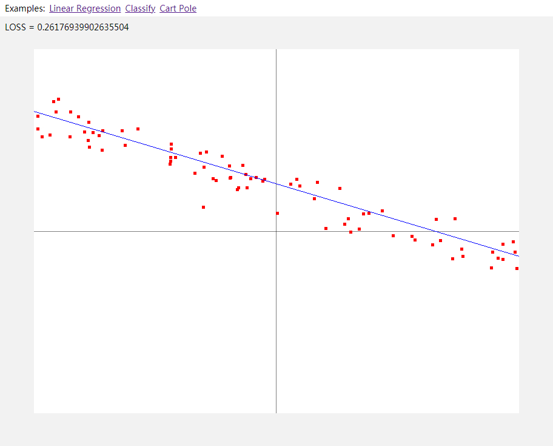
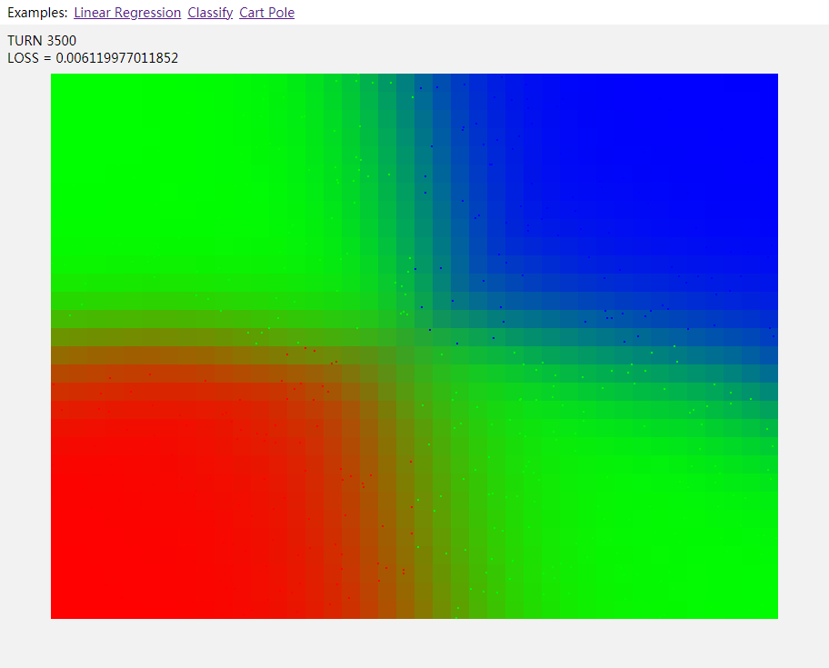
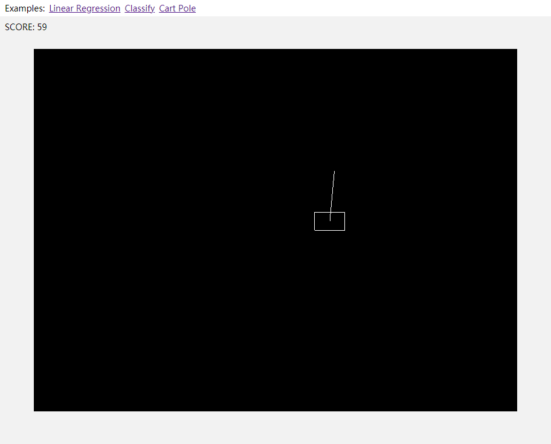

Toy automatically differentiate





## Project setup
```
npm install
```

## Development
```
npm run serve
```

## Compiles WASM
```
npm run asbuild
```

## Compiles and minifies for production
```
npm run build
```
